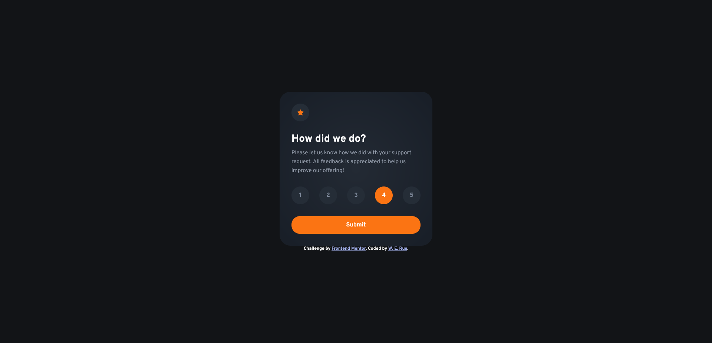

# Frontend Mentor - Interactive rating component solution

This is a solution to the [Interactive rating component challenge on Frontend Mentor](https://www.frontendmentor.io/challenges/interactive-rating-component-koxpeBUmI). Frontend Mentor challenges help you improve your coding skills by building realistic projects. 

## Table of contents

- [Overview](#overview)
  - [The challenge](#the-challenge)
  - [Screenshot](#screenshot)
  - [Links](#links)
- [My process](#my-process)
  - [Built with](#built-with)
  - [What I learned](#what-i-learned)
  - [Continued development](#continued-development)
- [Author](#author)

## Overview

### The challenge

Users should be able to:

- View the optimal layout for the app depending on their device's screen size
- See hover states for all interactive elements on the page
- Select and submit a number rating
- See the "Thank you" card state after submitting a rating

### Screenshot

### Links

[Live Site](https://werue.github.io/interactive-rating-component/)

## My process

### Built with

- Semantic HTML5 markup
- CSS custom properties
- Flexbox
- Vanilla Javascript

### What I learned

In this project, I learned how to style radio buttons. I used the adjacent sibling selector to style the label next to a checked radio button. I also learned how to use javaScript to toggle classes. In this project, I toggled a "hidden" class between the rating state and thank you state.

### Continued development

I haven't learned enough about Asynchronous JavaScript to make smooth transitions between the rating state and thank you state. I hope to further my knowledge and come back to accomplish that.

## Author

- Frontend Mentor - [@ywerue](https://www.frontendmentor.io/profile/werue)
